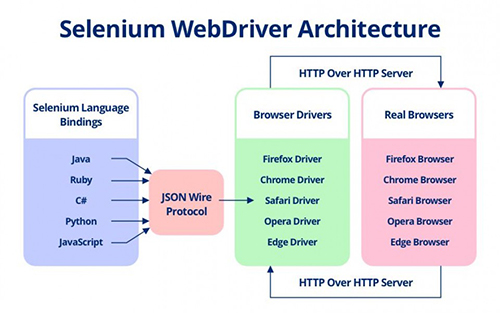
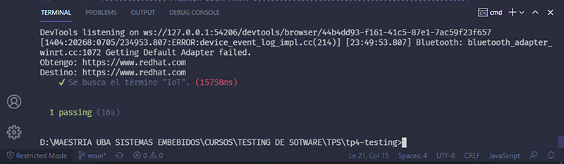

## Proyecto TP4 Testing - IOT (UBA)

Autor:
* Iván Cruz Flores

Docentes:

* Esp. Ing. Estevan Volentini.
* Esp. Ing. Alejandro Permingeat.
* Carlos Pantelides.

## TEMA: Selenium WebDriver

* Selenium es una herramienta de código abierto que se utiliza para automatizar las pruebas realizadas en los navegadores web. 
* Selenium WebDriver es un framework de automatización web que le permite ejecutar sus pruebas contra diferentes navegadores.



## Práctica de estudio:

Hacer funcionar webdriver con chrome tal que busque en google una palabra y vaya al
tercer resultado no patrocinado.

## Demostración de Funcionamiento:

* Funcionamiento. 
 https://youtu.be/FpIXaHp_KVE

## Resultado



## Dependencias NPM:
```
* Node Js.
* Chai Js.
* Mocha Js.
* chromedriver Js.
* selenium-webdriver Js.
```

